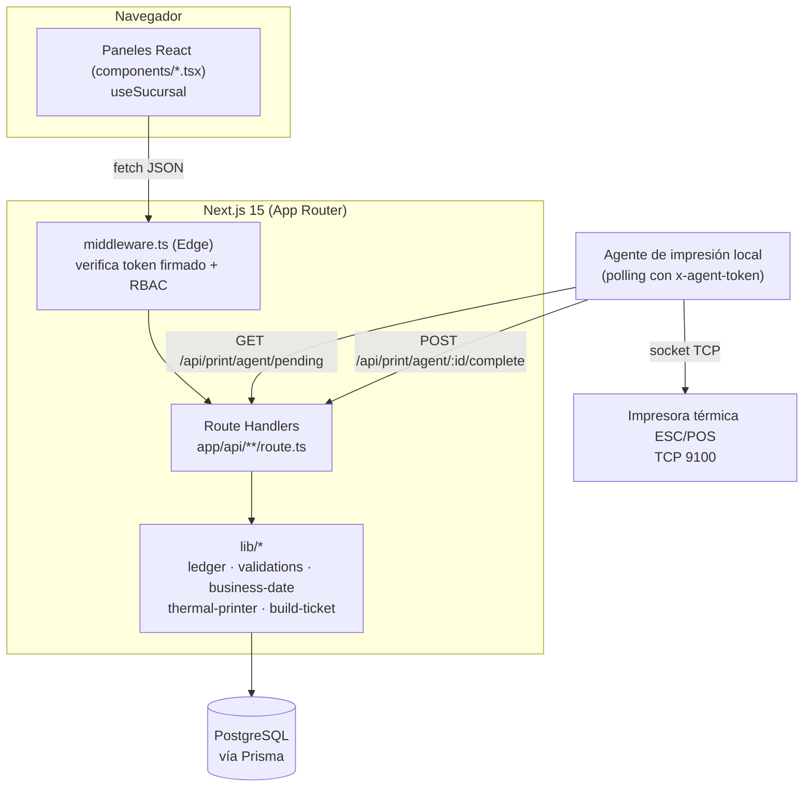
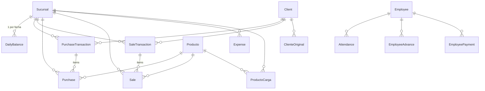
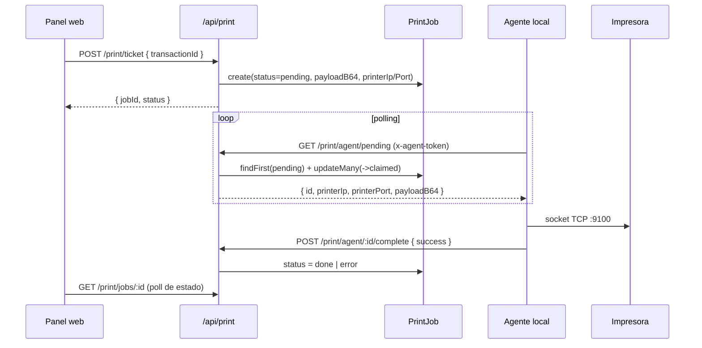

# C-Control — Documentación Técnica

> Sistema web de control diario de compras, ventas, gastos, inventario y personal para
> centros de acopio de café (Honduras). Construido sobre Next.js App Router, Prisma y PostgreSQL.

| | |
|---|---|
| **Nombre del paquete** | `r-control-api` |
| **Versión** | 1.0.0 |
| **Licencia** | MIT (privado) |
| **Runtime** | Node.js + Next.js 15 (App Router) |
| **Base de datos** | PostgreSQL vía Prisma 6 |
| **Idioma del dominio** | Español (Lempiras `L`, libras, quintales oro) |
| **Zona horaria de negocio** | `America/Tegucigalpa` |

---

## Tabla de contenido

1. [Visión general](#1-visión-general)
2. [Stack tecnológico](#2-stack-tecnológico)
3. [Arquitectura](#3-arquitectura)
4. [Estructura del repositorio](#4-estructura-del-repositorio)
5. [Modelo de datos](#5-modelo-de-datos)
6. [Lógica de negocio](#6-lógica-de-negocio)
7. [Contrato de la API REST](#7-contrato-de-la-api-rest)
8. [Autenticación, roles y acceso a módulos](#8-autenticación-roles-y-acceso-a-módulos)
9. [Frontend](#9-frontend)
10. [Impresión térmica](#10-impresión-térmica)
11. [Configuración y variables de entorno](#11-configuración-y-variables-de-entorno)
12. [Entorno de desarrollo local](#12-entorno-de-desarrollo-local)
13. [Migraciones de base de datos](#13-migraciones-de-base-de-datos)
14. [Pruebas](#14-pruebas)
15. [Despliegue](#15-despliegue)
16. [Convenciones de código](#16-convenciones-de-código)
17. [Observaciones y deuda técnica](#17-observaciones-y-deuda-técnica)

---

## 1. Visión general

C-Control administra la operación diaria de uno o varios centros de acopio (**sucursales**).
Todo el sistema gira alrededor de una **fecha de negocio** (`businessDate`, formato `YYYY-MM-DD`)
y de un **balance diario por sucursal** que se recalcula automáticamente ante cualquier movimiento.

Bloques funcionales:

| Módulo | Ruta web | Descripción |
|---|---|---|
| Dashboard | `/` | Resumen del día: saldo inicial, totales, movimientos recientes, agrupación por producto. |
| Compras | `/purchases` | Compras por cliente con carrito multi-producto, peso bruto/tara/sacos, impresión de ticket. |
| Ventas | `/sales` | Ventas por cliente, con modo de conversión a **quintales oro** para productos de café. |
| Gastos | `/expenses` | Registro de gastos por categoría. |
| Inventario | `/inventory` | Stock neto por producto (compras − ventas) y cargas/descargas de producto. |
| Clientes | `/clients` | Catálogo de clientes, datos IHCAFE y "clientes originales" asociados. |
| Sucursales | `/sucursales` | Alta/edición de sucursales, marca de principal y activo. |
| Personal | `/personnel` | Empleados, asistencia, adelantos y pagos. |
| Mantenimiento | `/maintenance` | Datos de empresa/impresora, usuarios del sistema, roles y permisos por módulo. |
| Login | `/login` | Autenticación por usuario/contraseña. |

**Ecuación central del negocio:**

```
saldoActual = saldoInicial + totalVentas − totalCompras − totalGastos
```

evaluada por `(businessDate, sucursalId)`.

---

## 2. Stack tecnológico

### Dependencias de producción

| Paquete | Versión | Uso |
|---|---|---|
| `next` | ^15.5.2 | Framework (App Router, Route Handlers, middleware) |
| `react` / `react-dom` | ^19.2.0 | UI |
| `@prisma/client` / `prisma` | ^6.16.2 | ORM y migraciones |
| `zod` | ^4.1.12 | Validación de payloads de la API |
| `lucide-react` | ^1.27.0 | Iconografía del sidenav |
| `dotenv` | ^17.2.3 | Carga de variables de entorno |

### Dependencias de desarrollo

`typescript` ^5.7.3 · `jest` ^30 + `ts-jest` · `eslint` ^9 + `eslint-config-next` + `typescript-eslint` · `@types/*`.

### Configuración TypeScript relevante

- `strict: true`, `noEmit: true`, target `ES2022`, `moduleResolution: "bundler"`.
- Alias de rutas: `@/*` → raíz del proyecto (`./`).

---

## 3. Arquitectura

Aplicación monolítica Next.js: el frontend (React Client Components) consume la propia API REST
del mismo despliegue mediante `fetch` relativo. No hay capa de estado global (Redux/Zustand);
cada panel gestiona su propio estado con hooks y refresca datos con `cache: 'no-store'`.



### Capas

| Capa | Responsabilidad | Ubicación |
|---|---|---|
| Middleware | Redirección a `/login` para páginas, RBAC para `/api`, inyección de cabeceras `x-auth-*` | `middleware.ts` |
| Route Handlers | Parseo/validación Zod → transacción Prisma → mapeo a DTO → `ApiResponse<T>` | `app/api/**/route.ts` |
| Dominio | Recálculo de balances, resolución de sucursal, conversión de decimales, agrupación de productos | `lib/ledger.ts`, `lib/producto-groups.ts`, `lib/business-date.ts` |
| Validación | Esquemas Zod compartidos por todas las rutas | `lib/validations.ts` |
| Sesión | Firma/verificación HMAC del token (Edge + Node) y hashing scrypt de contraseñas (solo Node) | `lib/session.ts`, `lib/password.ts` |
| Persistencia | Cliente Prisma singleton (evita fugas de conexiones en dev con HMR) | `lib/prisma.ts` |
| Autorización por módulo | Guard de servidor que resuelve `ModuleAccess` y redirige | `lib/require-module-access.ts`, `lib/module-access.ts` |
| Presentación | Paneles client-side + layout con sidenav y tema claro/oscuro | `app/`, `components/` |

### Patrón de respuesta uniforme

Todas las rutas devuelven `ApiResponse<T>` (`types/api.ts`):

```ts
type ApiSuccess<T> = { ok: true; data: T };
type ApiError = { ok: false; error: { code: string; message: string; details?: unknown } };
```

Los helpers viven en `lib/api-response.ts`:

- `success(data, status = 200)`
- `failure(code, message, status = 400, details?)`
- `handleApiError(error)` → `VALIDATION_ERROR` (400) para `ZodError`, `BAD_REQUEST` (400) para `Error`, `INTERNAL_ERROR` (500) en el resto.

---

## 4. Estructura del repositorio

```
c-control/
├── app/
│   ├── api/                  # 48 route handlers REST
│   │   ├── auth/             # login · logout · me
│   │   ├── clients/          # clientes y clientes originales (IHCAFE)
│   │   ├── employees/        # empleados · asistencia · adelantos · pagos
│   │   ├── expenses/         # gastos
│   │   ├── export/ import/   # exportación y carga histórica
│   │   ├── ledger/           # libro diario y saldo inicial
│   │   ├── print/            # tickets, resumen, cola de trabajos y agente
│   │   ├── producto-cargas/  # cargas/descargas de inventario
│   │   ├── productos/        # catálogo y stock
│   │   ├── purchases/ purchase-transactions/
│   │   ├── sales/ sale-transactions/
│   │   ├── settings/         # empresa · usuarios · module-access
│   │   └── sucursales/
│   ├── <módulo>/page.tsx     # server components: guard de módulo + panel de components/
│   ├── layout.tsx            # shell: fuentes, SiteHeader, globals.css
│   └── globals.css           # sistema de estilos completo (~800 líneas, sin Tailwind)
├── components/               # paneles de UI (client components)
├── lib/                      # dominio, validaciones, hooks y utilidades
├── prisma/
│   ├── schema.prisma
│   └── migrations/           # 16 migraciones SQL versionadas
├── tests/api/                # pruebas Jest de route handlers
├── types/                    # DTOs de dominio y envolturas de API
├── docs/api-contract.md      # contrato para la app móvil
├── middleware.ts
├── DEPLOY.md · README.md · DOCUMENTACION.md
└── next.config.mjs · jest.config.ts · vercel.json · railway.json
```

---

## 5. Modelo de datos

### Diagrama de relaciones



### Convenciones del esquema

- **IDs**: `cuid()` en todos los modelos (excepto `CompanySettings`, singleton con id fijo `"singleton"`).
- **Dinero y pesos**: `Decimal` con precisión explícita (`@db.Decimal(12,2)` para montos, `(10,2)` para libras/precios, `(6,4)` para factores/porcentajes). En el borde de la API se convierten a `number` con `decimalToNumber()`.
- **Fechas de negocio**: `DateTime @db.Date`; se serializan como `YYYY-MM-DD`.
- **Borrado**: `onDelete: Restrict` en catálogos (producto, cliente, sucursal, empleado) para impedir borrar entidades con movimientos; `Cascade` en items de transacción y en `ClienteOriginal`.

### Tablas principales

#### `Sucursal`

`nombre` (único), `direccion?`, `esPrincipal`, `activo`. Es la raíz de particionamiento de todos los
movimientos. Si no existe ninguna, `getDefaultSucursalId()` crea automáticamente **"Sucursal Principal"**.

#### `Producto`

`nombre` (único), `categoria?` (`uva` | `pergamino`), `precioPorLibra`, `taraPorSaco?`, `factorConversionOro?`.
La categoría determina si en Ventas se habilita el modo de conversión a oro.

#### `ProductoCarga`

Registro de carga/descarga de inventario por producto y sucursal (`businessDate`, `libras?`, `descripcion?`).
Actúa como **punto de corte del stock**: el cálculo de existencias parte desde la última carga.

#### `Client` y `ClienteOriginal`

`Client` almacena `nombre` (compuesto por `"nombres apellidos"` al crear), datos fiscales (`rtn`,
`cuentaBancaria`), `claveIhcafe` y la bandera `esGeneral`. El cliente **General** se autogenera al
listar clientes si no existe. `ClienteOriginal` guarda los productores originales (nombres,
apellidos, clave IHCAFE) que respaldan a un cliente.

#### `PurchaseTransaction` / `Purchase`

Cabecera + líneas de una compra por cliente. Cada `Purchase` guarda, además del resultado
(`libras`, `total`), la trazabilidad del pesaje: `pesoBruto`, `numeroSacos`, `taraPorSaco`, `quintalesOro`.
`Purchase.purchaseTransactionId` es opcional: existen compras legacy sin cabecera.

#### `SaleTransaction` / `Sale`

Cabecera + líneas de venta. `Sale` soporta dos formas:

- **Venta simple/libre**: solo `descripcion` + `monto` (sin producto).
- **Venta por producto**: `productoId`, `libras`, y `precioPorLibra` *o* el trío oro
  (`porcentajeOro`, `quintalesOro`, `precioPorQuintalOro`).

> ⚠️ `Sale.porcentajeOro` se guarda como **porcentaje** (`53.0000`), mientras que
> `Producto.factorConversionOro` se guarda como **fracción**. Son campos distintos.

#### `DailyBalance`

`@@unique([businessDate, sucursalId])`. Contiene `saldoInicial` (editable, requiere admin) y
`saldoActual` (derivado, nunca se escribe a mano).

#### `Expense`

`categoria`, `descripcion`, `monto` por fecha y sucursal.

#### Personal

`Employee` (nombre, puesto, teléfono, salario, fechaIngreso, activo), `Attendance`
(`@@unique([businessDate, employeeId])`, `horaEntrada`/`horaSalida` como `HH:MM`),
`EmployeeAdvance` (adelantos) y `EmployeePayment` (pagos).

#### Configuración y sistema

- `CompanySettings` — singleton con datos de la empresa e IP/puerto de la impresora térmica.
- `User` — usuarios persistidos (`userId` único, `password` hasheado con scrypt, `role`, `activo`).
- `ModuleAccess` — override de roles permitidos por módulo (`roles String[]`).
- `PrintJob` — cola de impresión (`pending` → `claimed` → `done` | `error`).
- `SyncEvent` — bitácora de eventos de sincronización (se exporta; hoy sin escritores activos).

---

## 6. Lógica de negocio

### 6.1 Fecha de negocio

`lib/business-date.ts`:

- `parseBusinessDate(str)` — exige `YYYY-MM-DD` y construye la fecha como **medianoche UTC**, evitando corrimientos de día.
- `toBusinessDateString(date)` — `date.toISOString().slice(0,10)`.
- `todayBusinessDate()` — fecha de hoy formateada en `America/Tegucigalpa` (`Intl.DateTimeFormat('en-CA')`).

### 6.2 Recálculo del balance diario

`lib/ledger.ts` expone las tres funciones que sostienen la consistencia:

| Función | Comportamiento |
|---|---|
| `ensureDailyBalance(db, fecha, sucursalId)` | `upsert` del `DailyBalance`; si no existe lo crea con saldos en 0. |
| `recalculateDailyBalance(...)` | Agrega `SUM(Purchase.total)`, `SUM(Sale.monto)`, `SUM(Expense.monto)` del día/sucursal y reescribe `saldoActual = saldoInicial + ventas − compras − gastos`. |
| `getLedgerByDate(...)` | Asegura + recalcula + devuelve el `LedgerDTO` con listas de compras, ventas y gastos ordenadas por `createdAt desc`. |

**Invariante:** toda ruta que cree o elimine compras, ventas o gastos llama a `recalculateDailyBalance`
**dentro de la misma transacción Prisma**. El saldo nunca se ajusta por deltas, siempre se recalcula desde cero.

> Los movimientos de personal (pagos y adelantos) **no** afectan el balance diario.

### 6.3 Resolución de sucursal

`resolveSucursalId(db, sucursalId?)` devuelve el id recibido o, si viene vacío, la sucursal
principal (`esPrincipal: true`), la más antigua, o una recién creada. Esto permite que clientes
antiguos o la app móvil omitan `sucursalId` sin romperse.

### 6.4 Compras — pesaje con tara

En `POST /api/purchase-transactions`, por cada línea:

```
si se envía pesoBruto:
    taraTotal = (taraPorSaco ?? producto.taraPorSaco ?? 0) × (numeroSacos ?? 0)
    libras    = pesoBruto − taraTotal
si no:
    libras    = libras (enviadas directamente)

precioPorLibra = línea.precioPorLibra ?? producto.precioPorLibra
quintalesOro   = (libras / 100) × (producto.factorConversionOro ?? 1)
total          = precioPorLibra × libras
```

El total de la transacción es la suma de los totales de línea. La validación Zod
(`createPurchaseLineSchema`) exige que se envíe **`libras` o `pesoBruto`**.

### 6.5 Ventas — conversión a quintales oro

En `POST /api/sale-transactions`, cada línea toma una de dos rutas:

**Modo oro** (cuando llega `precioPorQuintalOro`; entonces `porcentajeOro` es obligatorio):

```
quintalesVendidos = libras / 100
quintalesOro      = quintalesVendidos × (porcentajeOro / 100) / 1.25
monto             = quintalesOro × precioPorQuintalOro
```

El divisor `1.25` es el factor de rendimiento de pergamino a oro del negocio.

**Modo por libra** (resto de casos):

```
precioPorLibra = línea.precioPorLibra ?? producto.precioPorLibra
monto          = precioPorLibra × libras
```

El modo oro se habilita en la UI solo cuando `producto.categoria ∈ {uva, pergamino}`
(`isCafeCategoria`, chequeo estricto por categoría, sin inferencia por nombre).

### 6.6 Agrupación de productos

`lib/producto-groups.ts` clasifica productos en **En Uva**, **En Pergamino** y **Otros**:
primero por el campo `categoria`; si está vacío, por coincidencia de palabras clave en el nombre
normalizado sin diacríticos (`uva/verde/requema/guacuco/repaso` → uva;
`mojado/oriado/seco/segundo/corriente` → pergamino).

### 6.7 Inventario y stock

`GET /api/productos/stock` calcula **stock neto = libras compradas − libras vendidas**.

- Con `from`/`to`: se limita al rango.
- Sin rango y con `productoId`: se busca la última `ProductoCarga` del producto (y sucursal) y se
  consideran únicamente los movimientos **posteriores** a esa fecha; la carga se devuelve en `ultimaCarga`.
- Sin `productoId`: agrega totales por producto, ordenados de mayor a menor.

### 6.8 Importación histórica

`POST /api/import` (rol admin) acepta el formato legacy con claves `materials` / `materialId` / `material`.

> ⚠️ **Destructivo:** la ruta hace `deleteMany` de compras, transacciones, ventas y gastos de las
> `businessDate` del payload antes de reinsertar. El payload debe contener exactamente los datos
> que se desean reemplazar.

### 6.9 Exportación

`GET /api/export` (rol admin) devuelve un snapshot completo: `sucursales`, `dailyBalances`,
`purchases`, `sales`, `expenses`, `productos`, `clients`, `purchaseTransactions`,
`saleTransactions` y `syncEvents`, con filtros opcionales `businessDate` y `sucursalId`.

---

## 7. Contrato de la API REST

Base: `/api`. Todas las respuestas usan `ApiResponse<T>`.

### Autenticación

| Método | Ruta | Descripción |
|---|---|---|
| POST | `/api/auth/login` | Body `{ userId, password }`. Valida contra la tabla `User` y, si falla, contra `RBAC_USERS_JSON`. Devuelve `{ userId, role, token, expiresAt }` y setea la cookie HttpOnly `rcontrol_user` (7 días). |
| POST | `/api/auth/logout` | Expira la cookie. |
| GET | `/api/auth/me` | `{ userId, role }` verificando la sesión y reconsultando el rol en la base; ambos `null` si no hay sesión o el usuario fue desactivado. |

Los clientes no web envían `Authorization: Bearer <token>` con el token devuelto por el login.

### Catálogos

| Método | Ruta | Notas |
|---|---|---|
| GET / POST | `/api/productos` | `createProductoSchema`. |
| PATCH / DELETE | `/api/productos/:id` | `updateProductoSchema` (parcial). |
| GET | `/api/productos/stock` | Query: `productoId?`, `sucursalId?`, `from?`, `to?`. |
| GET / POST | `/api/producto-cargas` | Cargas de inventario. Query GET: `productoId?`, `sucursalId?`. |
| DELETE | `/api/producto-cargas/:id` | |
| GET / POST | `/api/clients` | GET autogenera el cliente "General". POST compone `nombre` = `nombres + apellidos`. |
| PATCH / DELETE | `/api/clients/:id` | |
| GET / POST | `/api/clients/:id/originales` | Clientes originales (IHCAFE) del cliente. |
| PATCH / DELETE | `/api/clients/:id/originales/:originalId` | |
| GET / POST | `/api/sucursales` | GET asegura la sucursal principal. |
| PATCH / DELETE | `/api/sucursales/:id` | |

### Operación diaria

| Método | Ruta | Notas |
|---|---|---|
| GET | `/api/ledger` | Query `businessDate?` (por defecto hoy en Tegucigalpa), `sucursalId?`. Devuelve `LedgerDTO`. |
| POST | `/api/ledger/initial-balance` | **admin.** `{ businessDate, sucursalId?, saldoInicial }`. |
| POST | `/api/purchases` | Compra simple legacy `{ businessDate, productoId, libras, precioPorLibra?, sucursalId? }`. |
| DELETE | `/api/purchases/:id` | Recalcula el balance. |
| GET / POST | `/api/purchase-transactions` | Compra por cliente con `items[]`. GET filtra por `businessDate` y `sucursalId`. |
| DELETE | `/api/purchase-transactions/:id` | Borra cabecera + items (cascade) y recalcula. |
| POST | `/api/sales` | Venta simple `{ businessDate, descripcion, monto, sucursalId? }`. |
| DELETE | `/api/sales/:id` | |
| GET / POST | `/api/sale-transactions` | Venta por cliente con `items[]` (modo libra u oro). |
| DELETE | `/api/sale-transactions/:id` | |
| POST | `/api/expenses` | `{ businessDate, categoria, descripcion, monto, sucursalId? }`. |
| DELETE | `/api/expenses/:id` | |

### Personal — **todas requieren rol `admin`**

| Método | Ruta |
|---|---|
| GET / POST | `/api/employees` |
| PATCH / DELETE | `/api/employees/:id` |
| GET / POST · PATCH / DELETE | `/api/employees/attendance` · `/api/employees/attendance/:id` |
| GET / POST · DELETE | `/api/employees/advances` · `/api/employees/advances/:id` |
| GET / POST · DELETE | `/api/employees/payments` · `/api/employees/payments/:id` |

### Configuración

| Método | Ruta | Notas |
|---|---|---|
| GET / PATCH | `/api/settings/company` | Datos de empresa + `printerIp` / `printerPort`. |
| GET / POST | `/api/settings/users` | Gestión de usuarios de BD. |
| PATCH / DELETE | `/api/settings/users/:id` | |
| GET | `/api/settings/module-access` | Devuelve todos los módulos con sus roles efectivos. |
| PATCH | `/api/settings/module-access` | **admin.** Rechaza módulos `locked`. |

### Impresión

| Método | Ruta | Notas |
|---|---|---|
| POST | `/api/print/ticket` | `{ transactionId, kind?: 'purchase' \| 'sale' }` → encola `PrintJob`. |
| GET | `/api/print/ticket/data` | Devuelve `payloadB64` sin encolar (impresión directa desde el cliente). |
| POST | `/api/print/summary` | `{ businessDate, sucursalId? }` → encola el resumen del día. |
| GET | `/api/print/summary/data` | `payloadB64` del resumen. |
| GET | `/api/print/jobs/:id` | Estado del trabajo (`pending` / `claimed` / `done` / `error`). |
| GET | `/api/print/agent/pending` | **Agente.** Reclama atómicamente el trabajo pendiente más antiguo. |
| POST | `/api/print/agent/:id/complete` | **Agente.** `{ success: boolean, error?: string }`. |

### Datos y utilidades

| Método | Ruta | Notas |
|---|---|---|
| GET | `/api/health` | Público (exento de RBAC). |
| GET | `/api/export` | **admin.** Snapshot completo. |
| POST | `/api/import` | **admin.** Destructivo por fecha. |

### Códigos de error usados

`VALIDATION_ERROR` · `BAD_REQUEST` · `NOT_FOUND` · `UNAUTHORIZED` · `FORBIDDEN` ·
`MISSING_QUERY` · `INTERNAL_ERROR` · `RBAC_CONFIG_ERROR` · `PRINTER_NOT_CONFIGURED` ·
`PRINT_AGENT_NOT_CONFIGURED`.

---

## 8. Autenticación, roles y acceso a módulos

### 8.1 Sesión

El login valida credenciales **primero contra la tabla `User`** (`getDbUserConfig`) y, si no
encuentra al usuario, contra `RBAC_USERS_JSON` (`getAuthUserConfig`).

La sesión es un **token firmado con HMAC-SHA256** (`lib/session.ts`), no el `userId` en claro:

```
rcontrol_user = base64url({ userId, role, exp }).base64url(firma)
                HttpOnly · SameSite=Lax · Path=/ · Secure en producción · maxAge 7 días
```

`POST /api/auth/login` devuelve además el token en el cuerpo (`data.token`, `data.expiresAt`)
para clientes no web, que lo reenvían como `Authorization: Bearer <token>`.

`lib/session.ts` usa **Web Crypto** (`crypto.subtle`) precisamente porque debe funcionar en los dos
runtimes: el Edge del middleware y el Node de los route handlers. Es la contraparte de
`lib/password.ts`, que al usar `node:crypto` solo puede vivir en route handlers.

| Función | Uso |
|---|---|
| `createSessionToken(userId, role)` | Firma el payload; devuelve `null` si falta el secreto. |
| `verifySessionToken(token)` | Devuelve el payload solo si la firma es válida y no expiró. |
| `readSessionToken(request)` | Lee de `Authorization: Bearer` y, si no, de la cookie. |
| `isSessionConfigured()` | Permite al login fallar con un error explícito. |

**El rol viaja firmado dentro del token.** Esa es la pieza que permite al middleware autorizar sin
consultar la base de datos, algo imposible desde Edge. La contrapartida es que un cambio de rol o
una desactivación **no invalidan los tokens ya emitidos**: surten efecto al expirar la sesión
(7 días) o al volver a entrar. `GET /api/auth/me` sí reconsulta la base, así que la UI refleja el
cambio de inmediato aunque el token siga siendo técnicamente válido para la API. Si necesitas
revocación más rápida, reduce `SESSION_TTL_SECONDS`.

> ⚠️ **`SESSION_SECRET` es obligatorio en producción.** Sin él la app no emite sesiones y nadie
> puede entrar (falla cerrado, en vez de firmar con un valor predecible). Fuera de producción se
> usa un secreto de desarrollo para que `pnpm dev` funcione sin configuración.
>
> Rotar el secreto invalida todas las sesiones activas: todos deben volver a iniciar sesión.

### 8.2 Almacenamiento de contraseñas

`lib/password.ts` implementa el hashing con **scrypt** de `node:crypto` (sin dependencias externas).
Formato almacenado:

```
scrypt$<salt-hex>$<derivada-hex>       salt de 16 bytes · clave derivada de 64 bytes
```

| Función | Uso |
|---|---|
| `hashPassword(plain)` | Genera sal aleatoria por contraseña y deriva la clave. |
| `verifyPassword(plain, stored)` | Compara en tiempo constante (`timingSafeEqual`); acepta tanto hashes como valores legacy en texto plano. |
| `needsRehash(stored)` / `isHashed(stored)` | Detectan valores legacy sin el prefijo del esquema. |

> ⚠️ **Frontera de runtime:** `lib/password.ts` usa `node:crypto` y solo puede importarse desde
> route handlers (runtime Node). No debe importarse desde `lib/auth.ts` ni desde nada que alcance
> `middleware.ts`, que corre en runtime Edge donde scrypt no existe.

**Migración de contraseñas legacy.** El sistema acepta los dos formatos durante la transición:

1. `POST /api/settings/users` y `PATCH /api/settings/users/:id` hashean siempre antes de escribir.
2. Al iniciar sesión un usuario de BD cuya contraseña siga en texto plano, el login la reemplaza
   por su hash de forma transparente (misma contraseña, sin intervención del usuario).
3. `pnpm hash-passwords` hace el backfill de una pasada, sin esperar a que cada usuario entre.
   Admite `--dry-run` para solo reportar.

Las contraseñas de `RBAC_USERS_JSON` viven en el entorno, no en la base: se comparan igual y el
formato hasheado también se acepta ahí, pero el login nunca las reescribe.

### 8.3 Middleware

`middleware.ts` corre sobre `['/api/:path*', '/((?!_next|favicon.ico|api).*)']`:

**Rutas de página (no `/api`)**

- Sin sesión válida → redirección a `/login`, limpiando de paso la cookie inválida o expirada.
- Con sesión válida visitando `/login` → redirección a `/`.

**Rutas `/api`** — exentas: `/api/auth/*`, `/api/health`, `/api/print/agent/*` (este último se
autentica con `PRINT_AGENT_TOKEN`). El resto exige sesión válida salvo que se desactive con
`RBAC_ENABLED=false`; **el valor por defecto es activo**, de modo que dejar la API sin control de
acceso tenga que ser una decisión explícita.

La identidad y el rol salen exclusivamente del token firmado. La cabecera `x-user-id` **ya no
autentica**: era una afirmación sin verificar, con la que cualquiera podía declararse `admin`.

### 8.4 Jerarquía de roles

```
viewer (1) < comprador (2) = editor (2) < admin (3)
```

Reglas por método y ruta (`requiredRole`):

| Condición | Rol mínimo |
|---|---|
| `/api/export`, `/api/import`, `/api/ledger/initial-balance`, `/api/employees/*` | `admin` |
| `PATCH /api/settings/module-access` | `admin` |
| Cualquier `DELETE` | `admin` |
| `POST` / `PUT` / `PATCH` | `editor` |
| `GET` | `viewer` |

En éxito, el middleware añade `x-auth-user-id` y `x-auth-role` a la respuesta.

### 8.5 Acceso por módulo

`lib/modules.ts` define `MODULE_DEFS` con `key`, `href`, `label`, `defaultRoles` y `locked`.

| Módulo | Roles por defecto | Locked |
|---|---|---|
| `dashboard` | editor, viewer | — |
| `purchases` | editor, viewer, comprador | — |
| `sales` | editor, viewer, comprador | — |
| `expenses` | editor, viewer, comprador | — |
| `inventory` | editor, viewer | — |
| `personnel` | — | — |
| `clients` | — | ✅ |
| `sucursales` | — | ✅ |
| `maintenance` | — | ✅ |

- `admin` siempre pasa (`isRoleAllowed` cortocircuita).
- Los módulos `locked` **siempre** requieren admin y `PATCH /api/settings/module-access` los rechaza:
  esto garantiza que Mantenimiento nunca quede inaccesible por una mala configuración.
- Los overrides configurables se guardan en `ModuleAccess`.

**La autorización por módulo se aplica en el servidor.** Cada página o layout de módulo es un
server component que empieza llamando a `requireModuleAccess(moduleKey, redirectTo = '/')`
(`lib/require-module-access.ts`):

1. Verifica la sesión leyendo la cookie; sin sesión válida → `redirect('/login')`.
2. **Reconsulta el rol en la base** en vez de confiar en el que viaja firmado en el token, de modo
   que un cambio de rol o una desactivación surten efecto en la siguiente navegación.
3. Resuelve los roles del módulo con `getModuleRoles` y, si el rol no está permitido,
   `redirect(redirectTo)`.

Falla cerrado por construcción: todo camino que no confirme el permiso termina en `redirect`, y un
error de base de datos propaga en vez de conceder acceso.

Esto vive en las páginas y no en el middleware porque `ModuleAccess` está en la base de datos, y el
middleware corre en Edge sin acceso a Prisma. El reparto queda así:

| Capa | Qué garantiza |
|---|---|
| `middleware.ts` (Edge) | Que haya sesión válida y que el rol alcance para el método HTTP. |
| `requireModuleAccess` (páginas, Node) | Que el rol tenga permitido **ese módulo** según `ModuleAccess`. |
| Sidenav (`site-header.tsx`) | Solo oculta enlaces. Es presentación, no control. |

`lib/module-access.ts` concentra la resolución de roles efectivos (`getModuleAccess`,
`getModuleRoles`) y la comparten el guard y `GET/PATCH /api/settings/module-access`, para que no
puedan divergir.

### 8.6 Usuarios de fallback

`lib/auth.ts` define cuentas de prueba solo si `RBAC_USERS_JSON` está ausente o es inválido:

| Usuario | Rol | Contraseña |
|---|---|---|
| `operador1` | editor | `operador123` |
| `consulta1` | viewer | `consulta123` |
| `comprador1` | comprador | `comprador123` |

**No existe un admin por defecto ni hardcodeado**: los administradores deben crearse en
Mantenimiento → Usuarios (tabla `User`), decisión deliberada para no dejar una puerta trasera no revocable.

---

## 9. Frontend

### 9.1 Shell y estilos

`app/layout.tsx` define el shell: fuentes de Google (`Syne` para títulos, `Plus Jakarta Sans` para
texto, expuestas como variables CSS), `SiteHeader` y `app/globals.css`.

No se usa Tailwind ni librería de componentes: `globals.css` (~800 líneas) implementa el sistema de
diseño completo con variables CSS y clases utilitarias (`page-shell`, `hero`, `btn-primary`,
`btn-secondary`, `sidenav-*`, `auth-pill`, …).

### 9.2 Navegación

`components/site-header.tsx` renderiza un sidenav que:

- Filtra los módulos visibles combinando `/api/auth/me` con `/api/settings/module-access`.
- Agrupa Mantenimiento con subenlaces (Usuarios, Roles y permisos, Clientes, Sucursales).
- Persiste en `localStorage`: tema (`rcontrol-theme`, con fallback a `prefers-color-scheme`) y
  estado colapsado (`rcontrol-sidenav-collapsed`), aplicados como `data-theme` y `data-sidenav`
  sobre `<html>`.

### 9.3 Páginas y paneles

Cada `page.tsx` es un server component mínimo que llama a `requireModuleAccess` y luego monta un
panel de `components/`. Los paneles ya no comprueban permisos: llegan a renderizarse solo si el
servidor autorizó la navegación.

| Panel | Líneas | Contenido |
|---|---|---|
| `sales-panel.tsx` | 722 | Ventas por cliente, carrito, modo oro, impresión. |
| `purchases-panel.tsx` | 657 | Compras por cliente, pesaje bruto/tara/sacos, ticket. |
| `clients-panel.tsx` | 457 | Clientes y clientes originales IHCAFE. |
| `dashboard-home.tsx` | 382 | Resumen diario y agrupación por producto. |
| `inventory-panel.tsx` | 346 | Stock neto y cargas. |
| `personnel-*.tsx` | 177–300 | Empleados, asistencia, adelantos, pagos. |
| `maintenance-*.tsx` | 147–220 | Empresa, usuarios, roles. |
| `sucursales-panel.tsx` | 208 | Sucursales. |
| `expenses-panel.tsx` | 171 | Gastos. |
| `client-quick-create-modal.tsx` | 167 | Alta rápida de cliente desde compras/ventas. |

Los layouts de `/personnel` y `/maintenance` son server components: aplican `requireModuleAccess`
y renderizan pestañas
(`personnel-tabs.tsx`, `maintenance-tabs.tsx`).

### 9.4 Hooks compartidos

| Hook | Archivo | Función |
|---|---|---|
| `useSucursal()` | `lib/use-sucursal.ts` | Carga sucursales, filtra activas, persiste la selección en `localStorage` (`rcontrol_sucursal_id`) y cae a la principal si la guardada ya no existe. |
| `requireModuleAccess()` | `lib/require-module-access.ts` | **No es un hook**: se llama desde el server component de cada página o layout de módulo y redirige si el rol no tiene permiso. |

---

## 10. Impresión térmica

Impresión ESC/POS de 32 columnas hacia impresoras de red (puerto TCP 9100 por defecto).

`lib/thermal-printer.ts` construye los buffers binarios (`ESC @` init, `ESC a` alineación,
`ESC E` negrita, `GS V` corte) y expone:

- `buildTicketBuffer(data)` — comprobante de compra/venta. Si la línea trae `quintalesOro` +
  `precioPorQuintalOro`, imprime el detalle en formato oro; en caso contrario, `lb × precio`.
- `buildSummaryBuffer(data)` — resumen del día con totales y cierre estimado de caja.
- `sendToPrinter(ip, port, buffer, timeoutMs = 5000)` — socket TCP crudo con timeout.

`lib/build-ticket.ts` reúne los datos (transacción + `CompanySettings`, que se autocrea vía upsert)
y devuelve `{ buffer, company }`.

### Flujo con agente local

Como el servidor desplegado (Vercel) no puede abrir sockets hacia la LAN del cliente, la impresión
se desacopla mediante la tabla `PrintJob`:



El reclamo del trabajo es atómico: el `updateMany` filtra por `status: 'pending'` y solo procede si
`count > 0`, evitando que dos agentes tomen el mismo job.

**Autenticación del agente** (`lib/print-agent-auth.ts`): header `x-agent-token` comparado contra
`PRINT_AGENT_TOKEN`. Si la variable no está configurada, responde `500 PRINT_AGENT_NOT_CONFIGURED`.
Las rutas `/api/print/agent/*` están exentas del RBAC del middleware.

Alternativamente, `GET /api/print/ticket/data` y `GET /api/print/summary/data` devuelven el
`payloadB64` para que el propio navegador o una app móvil lo envíen a la impresora sin pasar por la cola.

Si `CompanySettings.printerIp` está vacío, las rutas de encolado responden
`400 PRINTER_NOT_CONFIGURED` remitiendo a Mantenimiento → Empresa.

---

## 11. Configuración y variables de entorno

| Variable | Requerida | Descripción |
|---|---|---|
| `DATABASE_URL` | ✅ | Cadena de conexión PostgreSQL usada por Prisma. |
| `SESSION_SECRET` | ✅ en producción | Clave para firmar las sesiones (HMAC-SHA256). Sin ella, en producción no se emiten sesiones. Generar con `node -e "console.log(require('crypto').randomBytes(48).toString('base64url'))"`. |
| `PRINT_AGENT_TOKEN` | Solo con agente | Token compartido con el agente de impresión local. |
| `RBAC_ENABLED` | No (`true`) | Ponerlo en `false` desactiva el control de acceso de `/api`. |
| `RBAC_USERS_JSON` | No | Usuarios/roles de fallback en JSON. Ej.: `{"operador1":{"role":"editor","password":"operador123"}}`. |
| `NODE_ENV` | Automática | Marca la cookie de sesión como `secure` en producción y decide si se admite el secreto de desarrollo. |

Otros archivos de configuración:

- `next.config.mjs` — `reactStrictMode: true`.
- `vercel.json` — build `npm run vercel-build`; cabeceras `Cache-Control: no-cache, no-store, must-revalidate` para todo `/api/*`.
- `railway.json` — únicamente la referencia de schema.
- `.prettierrc`, `eslint.config.mjs` — formato y linting.

---

## 12. Entorno de desarrollo local

```bash
pnpm install                # dispara postinstall → prisma generate
cp .env.example .env        # y edita DATABASE_URL
pnpm prisma:generate
pnpm prisma:migrate
pnpm dev                    # http://localhost:3000
```

### Scripts disponibles

| Script | Comando | Uso |
|---|---|---|
| `dev` | `next dev` | Servidor de desarrollo. |
| `build` | `next build` | Compilación de producción. |
| `vercel-build` | `prisma generate && prisma migrate deploy && next build` | Build en Vercel (aplica migraciones). |
| `start` | `next start` | Servir el build. |
| `lint` | `next lint` | ESLint. |
| `test` | `jest` | Pruebas unitarias. |
| `prisma:generate` | `prisma generate` | Regenerar el cliente. |
| `prisma:migrate` | `prisma migrate dev --name init` | Migración en desarrollo. |
| `prisma:studio` | `prisma studio` | Explorador de datos. |
| `print-agent` | `node scripts/print-agent.js` | Agente de impresión — **el archivo no está en el repo** (ver §17). |
| `hash-passwords` | `node scripts/hash-passwords.mjs` | Backfill único de contraseñas legacy a scrypt. Acepta `--dry-run`. |

---

## 13. Migraciones de base de datos

16 migraciones versionadas en `prisma/migrations/`, en orden cronológico:

| Migración | Cambio |
|---|---|
| `20260508052018_init` | Esquema inicial. |
| `20260513000000_add_clients_and_purchase_transactions` | Clientes y compras por cliente. |
| `20260614000000_add_company_and_users` | `CompanySettings` y `User`. |
| `20260617044532_add_material_carga` | Cargas de material. |
| `20260707000000_add_printer_settings` | IP/puerto de impresora. |
| `20260707010000_add_print_jobs` | Cola `PrintJob`. |
| `20260712234500_rename_material_to_producto` | Renombrado Material → Producto. |
| `20260714213216_add_employees` | Empleados y pagos. |
| `20260715165823_add_attendance_and_advances` | Asistencia y adelantos. |
| `20260715230900_add_module_access` | Permisos por módulo. |
| `20260717061236_add_sale_transactions` | Ventas por cliente. |
| `20260719025908_add_client_ihcafe_and_clientes_originales` | Datos IHCAFE. |
| `20260720051954_add_coffee_purchase_fields` | `pesoBruto`, `numeroSacos`, `taraPorSaco`, `quintalesOro`. |
| `20260723000000_add_sucursales` | Multi-sucursal. |
| `20260816000000_add_producto_categoria` | `Producto.categoria`. |
| `20260818000000_add_sale_oro_fields` | `porcentajeOro`, `quintalesOro`, `precioPorQuintalOro` en `Sale`. |

En producción: `prisma migrate deploy` (incluido en `vercel-build`).

> El renombrado Material → Producto ya está aplicado en el modelo, pero `POST /api/import`
> conserva el contrato JSON legacy (`materials` / `materialId` / `material`) por compatibilidad
> con los archivos históricos.

---

## 14. Pruebas

Jest con preset `ts-jest`, `testEnvironment: 'node'`, raíz `tests/` y alias `@/*` mapeado.

```bash
pnpm test
```

Cobertura actual (4 suites, 18 pruebas):

- `tests/api/health.test.ts` — invoca el handler `GET` y verifica `status: 'ok'`.
- `tests/api/productos.test.ts` — mockea `@/lib/prisma` y verifica que `POST /api/productos` devuelve 201.
- `tests/lib/password.test.ts` — formato scrypt, sal distinta por llamada, verificación correcta/incorrecta,
  entradas vacías y hashes malformados, compatibilidad con contraseñas legacy y `needsRehash`.
- `tests/lib/session.test.ts` — firma y recuperación del rol, `userId` no ASCII, rechazo de payload
  manipulado para escalar privilegios, de firmas inventadas, del formato legacy de cookie y de
  tokens expirados; precedencia de `Bearer` sobre cookie e indiferencia ante `x-user-id`.

Los route handlers se importan y ejecutan directamente (sin levantar servidor), pasando un
`Request` estándar. La cobertura sigue siendo baja: no hay pruebas de los cálculos de balance,
tara ni conversión a oro, que son la lógica de mayor riesgo.

---

## 15. Despliegue 

Arquitectura objetivo: **Vercel** (aplicación) + **Railway** (PostgreSQL). El detalle paso a paso
está en [DEPLOY.md](DEPLOY.md); resumen:

1. Crear la base PostgreSQL en Railway y copiar su `DATABASE_URL`.
2. Importar el repositorio en Vercel (framework Next.js, root `./`).
3. Configurar en Vercel `DATABASE_URL` y `SESSION_SECRET` (**ambas obligatorias**; sin la segunda
   nadie puede iniciar sesión) y, si aplica, `PRINT_AGENT_TOKEN`, `RBAC_ENABLED`, `RBAC_USERS_JSON`.
4. Build Command: `pnpm vercel-build` (genera cliente, aplica migraciones y compila).
5. Verificar `/api/health`.
6. Crear el primer usuario admin en la tabla `User` (Prisma Studio o SQL directo), ya que no existe
   admin por defecto. Se puede insertar la contraseña en texto plano: el login la acepta una vez y
   la convierte a hash en ese mismo momento (§8.2).
7. Tras el despliegue, las sesiones anteriores dejan de ser válidas porque cambió el formato de la
   cookie: todos los usuarios deben iniciar sesión una vez más.

---

## 16. Convenciones de código

- **Nombres del dominio en español** (`productoNombre`, `precioPorLibra`, `saldoInicial`), infraestructura en inglés.
- **Un esquema Zod por operación** en `lib/validations.ts`; las variantes de actualización se derivan con `.partial()`.
- **Mapeo explícito a DTO** en cada handler: nunca se devuelven entidades Prisma crudas; los `Decimal` pasan a `number` y las fechas a ISO / `YYYY-MM-DD`.
- **Escrituras multi-tabla dentro de `prisma.$transaction`**, siempre cerrando con `recalculateDailyBalance`.
- **Manejo de errores**: `throw new Error('Client not found')` dentro de la transacción y traducción a `failure('NOT_FOUND', …, 404)` en el `catch`.
- **Aritmética con `Prisma.Decimal`** (`.mul`, `.div`, `.sub`, `.add`) en cálculos monetarios, evitando el punto flotante nativo.
- **Componentes de UI**: `'use client'` en los paneles; las páginas del App Router son envoltorios de servidor.
- Los comentarios existentes explican el *porqué* de decisiones no obvias (módulos `locked`, ausencia de admin por defecto, unidades de `porcentajeOro`); conviene mantener ese estilo.

---

## 17. Observaciones y deuda técnica

Puntos a tener presentes al trabajar sobre el código:

1. ~~**Contraseñas en texto plano.**~~ **Resuelto**: `User.password` se guarda hasheado con scrypt
   (ver §8.2). Queda un residuo menor: las contraseñas de `RBAC_USERS_JSON` siguen siendo texto
   plano en el entorno por naturaleza — son cuentas de prueba y no deben usarse en producción.
   Tras desplegar, ejecutar `pnpm hash-passwords` para eliminar el texto plano remanente en la base.
2. ~~**Cookie de sesión sin firma.**~~ **Resuelto**: la sesión es un token firmado con HMAC-SHA256
   que incluye `userId`, `role` y `exp` (§8.1). Se eliminó también la autenticación por cabecera
   `x-user-id`, que era el mismo hueco por otra vía. Queda como limitación conocida la latencia de
   revocación: los cambios de rol y las desactivaciones no invalidan tokens ya emitidos.
3. ~~**El RBAC del middleware ignora los usuarios de BD.**~~ **Resuelto**: el rol viaja firmado en el
   token, que el login emite a partir del usuario de BD, así que el middleware ya autoriza a los
   usuarios creados en Mantenimiento. Además `RBAC_ENABLED` pasó a estar **activo por defecto**;
   antes, con el valor por defecto, la API entera quedaba sin control de acceso.
4. ~~**`useModuleGuard` falla en abierto.**~~ **Resuelto**: el hook cliente se eliminó y la
   autorización por módulo pasó al servidor con `requireModuleAccess` (§8.5), que falla cerrado.
   Como efecto colateral, las desactivaciones y los cambios de rol ahora surten efecto en la
   siguiente navegación en vez de esperar a que expire el token.
5. **`scripts/print-agent.js` no existe** en el repositorio aunque `package.json` expone
   `pnpm print-agent` y `.env` documenta su token. El agente debe recuperarse o reescribirse para
   que la cola `PrintJob` se drene.
6. **Convivencia de modelos legacy y por cliente.** Persisten `POST /api/purchases` y `POST /api/sales`
   (registros sin transacción cabecera) junto al flujo por cliente. Ambos alimentan el mismo balance.
7. **`POST /api/import` es destructivo por fecha** (`deleteMany` previo). Nunca ejecutarlo con payloads parciales.
8. **`SyncEvent` se exporta pero no se escribe** desde ninguna ruta actual.
9. **`LOGICA_NEGOCIO.md` fue eliminado del repositorio.** Describía persistencia en SQLite local y un
   modelo previo a las sucursales, ya sin correspondencia con el código. Este documento lo reemplaza
   como referencia de la lógica de negocio (§6).
10. **Cobertura de pruebas baja**: los cálculos críticos (recálculo de balance, tara, conversión a oro,
    stock neto) no tienen pruebas.

---

## Documentos relacionados

- [README.md](README.md) — guía rápida de instalación y RBAC.
- [DEPLOY.md](DEPLOY.md) — despliegue paso a paso en Vercel + Railway.
- [docs/api-contract.md](docs/api-contract.md) — contrato pensado para la app móvil.
